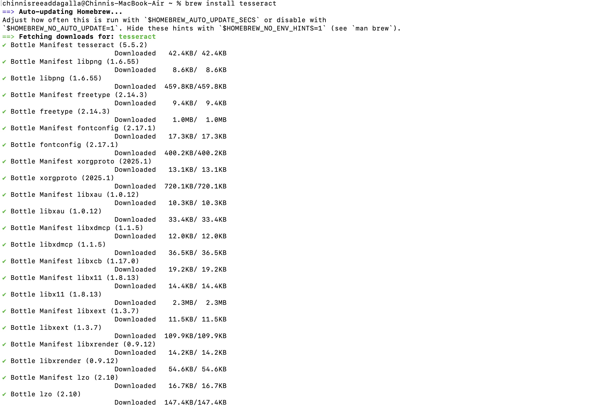
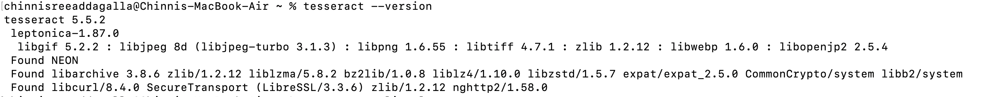
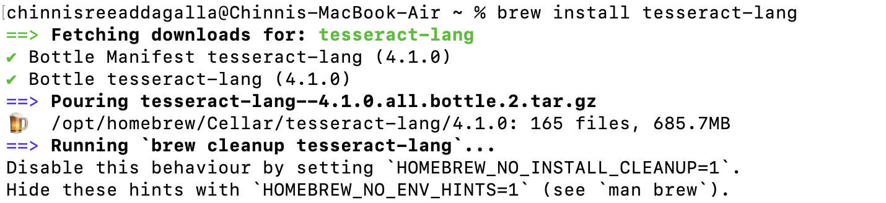
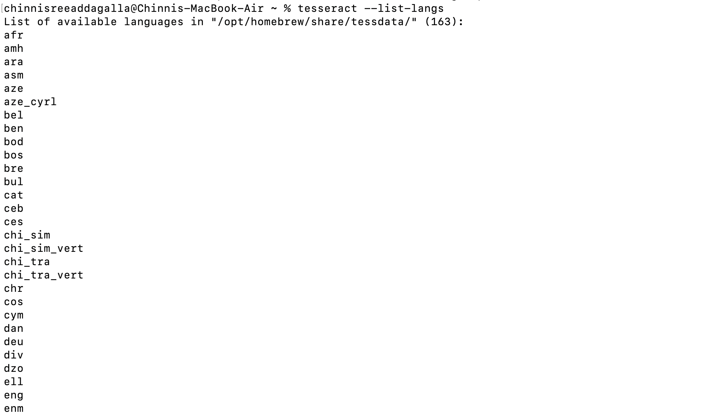
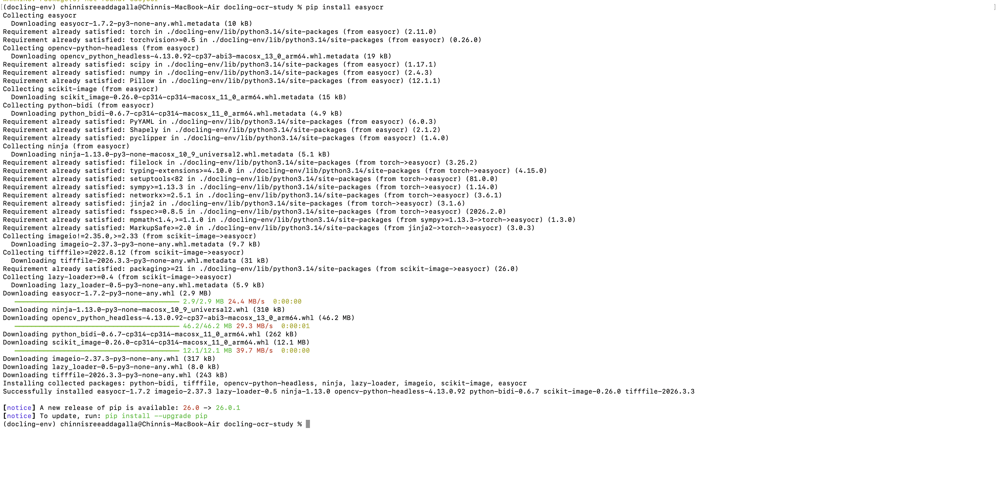
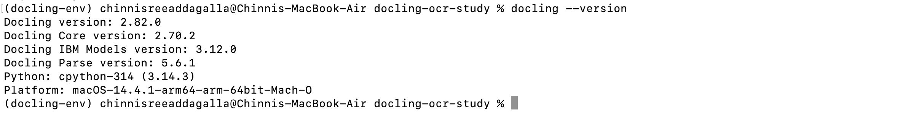
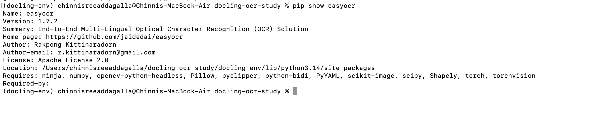
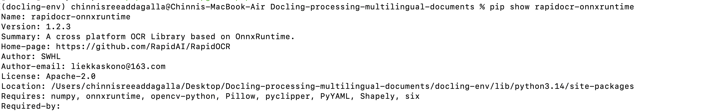

# Docling: Processing Multilingual Documents

## Table of Contents

- [Environment Setup](#environment-setup)
- [Step 1 — Installing Tesseract OCR](#step-1--installing-tesseract-ocr)
- [Step 2 — Setting Up Python Environment](#step-2--setting-up-python-environment)
- [Step 3 — Installing Docling](#step-3--installing-docling)
- [Step 4 — OCR Engines Used](#step-4--ocr-engines-used)
- [Step 5 — Documents Tested](#step-5--documents-tested)
- [Step 6 — Conversion Commands](#step-6--conversion-commands)
- [Step 7 — Key Findings](#step-7--key-findings)
- [Step 8 — OCR Engine Comparison](#step-8--ocr-engine-comparison)
- [Step 9 — Challenges and Limitations](#step-9--challenges-and-limitations)
- [Discussion](#discussion)
- [Repository Structure](#repository-structure)
- [References](#references)
## Overview

This repository documents my exploration of [Docling](https://github.com/docling-project/docling)'s OCR capabilities for processing scanned documents in multiple languages. This work is part of the [Outreachy](https://www.outreachy.org/) contribution task for the Fedora/Ramalama project (Issue #123).

The goal was to understand how Docling uses OCR to parse scanned documents converting image-based PDFs into structured text.

---

## Environment Setup

I completed this task on my personal MacBook Air with the following setup:

- **Operating System:** macOS 14.4.1 (Apple Silicon M1)
- **Python version:** 3.14.3
- **Package manager:** Homebrew 5.1.0

---

## Step 1 — Installing Tesseract OCR

I chose Tesseract as my primary OCR engine because it is the most widely used open-source OCR engine, supports over 100 languages through dedicated language packs, and is well-documented with a large community.

```bash
brew install tesseract
```



Verifying Tesseract installation and language support:

```bash
tesseract --version
```



```bash
brew install tesseract-lang
```



```bash
tesseract --list-langs
```



The languages `fra` (French), `ita` (Italian), and `tel` (Telugu) appeared in the language list, confirming Tesseract supports all the languages I planned to test.

---

## Step 2 — Setting Up Python Environment

I created a virtual environment to keep Docling and its dependencies isolated from the system Python:

```bash
mkdir docling-ocr-study
cd docling-ocr-study
python3 -m venv docling-env
source docling-env/bin/activate
```


---

## Step 3 — Installing Docling

```bash
pip install "docling[tesseract]"
pip install pytesseract
pip install easyocr
```



### Docling Version

```bash
docling --version
```




**Output:**
```
Docling version: 2.82.0
Docling Core version: 2.70.2
Docling IBM Models version: 3.12.0
Docling Parse version: 5.6.1
Python: cpython-314 (3.14.3)
Platform: macOS-14.4.1-arm64-arm-64bit-Mach-O
```


### EasyOCR Version

```bash
pip show easyocr
```



**Output:**
```
Name: easyocr
Version: 1.7.2
```

### RapidOCR Version

```bash
pip show rapidocr-onnxruntime
```


---

## Step 4 — OCR Engines Used

I tested three different OCR engines to compare their performance across languages:

| Engine | Type | Why I Chose It |
|--------|------|----------------|
| **Tesseract** | Classical OCR | Industry standard, 100+ language packs, open-source, widely documented |
| **EasyOCR** | AI/Deep Learning | Modern approach, supports 80+ languages, interesting comparison with Tesseract |
| **ocrmac** | Apple Vision Framework | Built into macOS no installation needed, interesting to see how Apple's built-in OCR performs |
| **RapidOCR** | AI/Deep Learning | Fast, lightweight, no need to specify a language flag, simple installation |
---

## Step 5 — Documents Tested

I chose documents in different languages and scripts to test OCR performance:

| Document | Language | Script Type | Source |
|----------|----------|-------------|--------|
| French+English Textbook | French + English | Latin | [Archive.org](https://archive.org/details/atextbookonfren00schogoog) |
| Italian Reader | Italian | Latin | [Archive.org](https://archive.org/details/anitalianreader01marigoog) |
| Telugu Manuscript (old) | Telugu | Indic — old style | [Archive.org](https://archive.org/details/gautamipushkarakritya) |
| Telugu Novel (modern) | Telugu | Indic — modern | [Archive.org](https://archive.org/details/in.ernet.dli.2015.491593) |


---

## Step 6 — Conversion Commands

### French + English — Tesseract
```bash
docling --from pdf --to md --ocr --ocr-engine tesseract \
  --ocr-lang fra+eng data/french-english-textbook.pdf
```

### Italian — Tesseract
```bash
docling --from pdf --to md --ocr --ocr-engine tesseract \
  --ocr-lang ita data/italian-document.pdf
```

### Italian — EasyOCR
```bash
docling --from pdf --to md --ocr --ocr-engine easyocr \
  --ocr-lang it data/italian-document.pdf
```

### Telugu Old Manuscript — Tesseract
```bash
docling --from pdf --to md --ocr --ocr-engine tesseract \
  --ocr-lang tel data/telugu-document.pdf
```

### Telugu Old Manuscript — EasyOCR
```bash
docling --from pdf --to md --ocr --ocr-engine easyocr \
  --ocr-lang te data/telugu-document.pdf
```

### Telugu Modern Novel — Tesseract
```bash
docling --from pdf --to md --ocr --ocr-engine tesseract \
  --ocr-lang tel data/telugu-modern.pdf
```

### Telugu Modern Novel — EasyOCR
```bash
docling --from pdf --to md --ocr --ocr-engine easyocr \
  --ocr-lang te data/telugu-modern.pdf
```

### French — ocrmac (Apple Vision)
```bash
docling --from pdf --to md --ocr --ocr-engine ocrmac \
  data/french-english-textbook.pdf
```

### Italian — ocrmac (Apple Vision)
```bash
docling --from pdf --to md --ocr --ocr-engine ocrmac \
  data/italian-document.pdf
```

### Telugu — ocrmac (Apple Vision)
```bash
docling --from pdf --to md --ocr --ocr-engine ocrmac \
  data/telugu-document.pdf
```

### French — RapidOCR
```bash
docling --from pdf --to md --ocr --ocr-engine rapidocr \
  data/french-english-textbook.pdf \
  --output output/
```
 
 
### Italian — RapidOCR
```bash
docling --from pdf --to md --ocr --ocr-engine rapidocr \
  data/italian-document.pdf \
  --output output/
```
 
 
### Telugu Old Manuscript — RapidOCR
```bash
docling --from pdf --to md --ocr --ocr-engine rapidocr \
  data/telugu-document.pdf \
  --output output/
```
 
 
### Telugu Modern Novel — RapidOCR
```bash
docling --from pdf --to md --ocr --ocr-engine rapidocr \
  data/telugu-modern.pdf \
  --output output/
```
 
 

---

## Step 7 — Key Findings

**1. Latin scripts worked well across all engines**
French and Italian converted cleanly and even special characters like accents were correctly preserved by all three engines.

**2. Font style matters more than language support**
The old Telugu manuscript gave poor results on all engines but the modern Telugu novel worked much better, showing that document age and font style affect OCR accuracy more than language support alone.

**3. EasyOCR did better than Tesseract on modern Telugu**
On the modern Telugu novel, EasyOCR produced cleaner output than Tesseract which was unexpected and shows that no single engine is always the best choice.

**4. ocrmac does not support Telugu**
Apple Vision OCR worked well on French and Italian but produced unreadable output on Telugu since it is not designed for Indic scripts.

**5. Always specify the language flag**
When I ran EasyOCR on Telugu without the language flag the output was wrong, but adding the correct language code immediately improved the results.

**6. RapidOCR handles Latin scripts well but struggles with Indic scripts**
RapidOCR gave clean output for French and Italian but struggled with both Telugu documents. It also auto-detects language, so no language flag is needed making it simpler to use for Latin-based documents.

---


## Step 8 — OCR Engine Comparison
 
### Evaluation Criteria
Before comparing, here is what I used to evaluate each engine:
- **Accuracy** — how correctly the text was extracted
- **Speed** — how fast the processing was
- **Language Support** — which languages and scripts are supported
- **Complexity** — how easy it was to install and use
 
### Comparison Table
 
| Engine | Speed | Accuracy | Language Support | Complexity |
|--------|-------|----------|-----------------|------------|
| **Tesseract** | Medium | Good for all Latin, decent for modern Telugu | 100+ languages with language packs | High, needs separate language pack per language |
| **EasyOCR** | Slow | Good for Latin, better than Tesseract on modern Telugu | 80+ languages | Easy, just pip install |
| **ocrmac** | Fast | Good for Latin only | Limited, no Indic script support | Zero install on Mac |
| **RapidOCR** | Fast | Good for Latin, poor for Indic | Limited Indic support | Easy, no language flag needed |
 
---

## Step 9 — Challenges and Limitations
 
**1. Old Telugu manuscript failed on all engines**:
The old-style script and font were too different from what modern OCR models are trained on, giving poor results across all engines
 
**ocrmac does not support Indic scripts**:
ocrmac is optimized for Latin-based languages and produced unreadable output for Telugu.
 
**3. RapidOCR struggles with Indic scripts**:
RapidOCR is not trained on Indic scripts and gave garbled output for both Telugu documents.
 
**4. EasyOCR is very slow**: 
EasyOCR took significantly longer than other engines, which can be a limitation for large documents.
 
**5. Tesseract requires specifying a language code**: 
Unlike other engines like RapidOCR, Tesseract requires you to specify the correct language code every time you run a command, otherwise the output will be incorrect.

## Discussion

### Why I Chose These OCR Engines

-  Tesseract felt like the obvious starting point, it's the most well-known open-source OCR engine.
- I added EasyOCR to see how a modern AI-based approach compares to a classical one.
- ocrmac was interesting because it needs zero installation on Mac, I was curious how Apple's built-in OCR holds up.
- RapidOCR was added based on feedback to broaden my knowledge, it is fast, lightweight and does not require specifying a language flag, making it a great option for Latin-based documents.
- Together these four cover classical, AI-based, platform-native, and fast lightweight OCR  a good range to compare.
 

---

## Repository Structure


```
├── data/
│   ├── french-english-textbook.pdf
│   ├── italian-document.pdf
│   ├── telugu-document.pdf
│   └── telugu-modern.pdf
├── output/
│   ├── french-tesseract-output.md
│   ├── french-ocrmac-output.md
│   ├── french-rapidocr-output.md
│   ├── italian-tesseract-output.md
│   ├── italian-easyocr-output.md
│   ├── italian-ocrmac-output.md
│   ├── italian-rapidocr-output.md
│   ├── telugu-tesseract-output.md
│   ├── telugu-easyocr-output.md
│   ├── telugu-ocrmac-output.md
│   ├── telugu-rapidocr-output.md
│   ├── telugu-modern-tesseract.md
│   ├── telugu-modern-easyocr.md
│   ├── telugu-modern-ocrmac.md
│   └── telugu-modern-rapidocr.md
├── screenshots/
│   ├── screenshot-1-tesseract-install.jpg
│   ├── screenshot-2-tesseract-version.jpg
│   ├── screenshot-3-tesseract-langs.jpg
│   ├── screenshot-4-tesseract-list-langs.jpg
│   ├── screenshot-6-easyocr-install.jpg
│   ├── screenshot-7-easyocr-version.jpg
│   ├── screenshot-8-doctr-install.jpg
│   ├── screenshot-9-rapid-ocr-install.png
│   ├── screenshot-10-rapidocr-french.png
│   ├── screenshot-11-rapidocr-italian.png
│   ├── screenshot-12-rapidocr-telugu.png
│   ├── screenshot-13-rapidocr-telugu-modern.png
│   ├── screenshot-14-docling-env.jpg
│   ├── screenshot-15-docling-version.jpg
│   └── screenshot-16-docling-version2.jpg
└── README.md
```

---

## References

- [Docling GitHub](https://github.com/docling-project/docling)
- [Tesseract OCR](https://github.com/tesseract-ocr/tesseract)
- [EasyOCR](https://github.com/JaidedAI/EasyOCR)
- [ocrmac](https://github.com/straussmaximilian/ocrmac)
- [RapidOCR](https://github.com/RapidAI/RapidOCR)
- [Outreachy Issue #123](https://gitlab.com/fedora/sigs/ai/ramalama/-/issues/123)
- [Internet Archive](https://archive.org)

---

## AI Assistance

I used Claude (Anthropic) to help understand concepts, troubleshoot errors and fix grammar in this README. All commands were run by me personally and all observations and findings are my own.