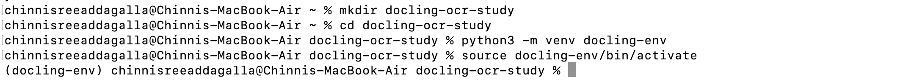
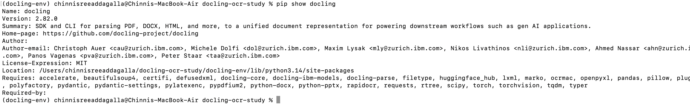

# Docling: Processing Multilingual Documents

## Overview

This repository documents my exploration of [Docling](https://github.com/docling-project/docling)'s OCR capabilities for processing scanned documents in multiple languages. This work is part of the [Outreachy](https://www.outreachy.org/) contribution task for the Fedora/Ramalama project (Issue #123).

The goal was to understand how Docling uses OCR to parse scanned documents converting image-based PDFs into structured text.

---

## Environment Setup

I completed this task on my personal MacBook Air with the following setup:

- **Operating System:** macOS 14.4.1 (Apple Silicon M1)
- **Python version:** 3.14.3
- **Package manager:** Homebrew 5.1.0
- **Docling version:** 2.82.0
- **Docling Core version:** 2.70.2
- **Docling IBM Models version:** 3.12.0
- **Docling Parse version:** 5.6.1

---

## Step 1 — Installing Tesseract OCR

I chose Tesseract as my primary OCR engine because it is the most widely used open-source OCR engine, supports over 100 languages through dedicated language packs, and is well-documented with a large community.

```bash
brew install tesseract
brew install tesseract-lang
```


Verifying Tesseract installation and language support:

```bash
tesseract --version
```


```bash
tesseract --list-langs
```


Both `fra` (French), `ita` (Italian) and `tel` (Telugu) appeared in the language list, confirming Tesseract supports all the languages I planned to test.

---

## Step 2 — Setting Up Python Environment

I created a virtual environment to keep Docling and its dependencies isolated from the system Python:

```bash
mkdir docling-ocr-study
cd docling-ocr-study
python3 -m venv docling-env
source docling-env/bin/activate
```



---

## Step 3 — Installing Docling

```bash
pip install "docling[tesseract]"
pip install pytesseract
pip install easyocr
```


### Docling Version

```bash
docling --version
```



**Output:**
```
Docling version: 2.82.0
Docling Core version: 2.70.2
Docling IBM Models version: 3.12.0
Docling Parse version: 5.6.1
Python: cpython-314 (3.14.3)
Platform: macOS-14.4.1-arm64-arm-64bit-Mach-O
```


### EasyOCR Version

```bash
pip show easyocr
```


**Output:**
```
Name: easyocr
Version: 1.7.2
```

---

## Step 4 — OCR Engines Used

I tested three different OCR engines to compare their performance across languages:

| Engine | Type | Why I Chose It |
|--------|------|----------------|
| **Tesseract** | Classical OCR | Industry standard, 100+ language packs, open-source, widely documented |
| **EasyOCR** | AI/Deep Learning | Modern approach, supports 80+ languages, interesting comparison with Tesseract |
| **ocrmac** | Apple Vision Framework | Built into macOS no installation needed, interesting to see how Apple's built-in OCR performs |

---

## Step 5 — Documents Tested

I chose documents in different languages and scripts to test OCR performance:

| Document | Language | Script Type | Source |
|----------|----------|-------------|--------|
| French+English Textbook | French + English | Latin | [Archive.org](https://archive.org/details/atextbookonfren00schogoog) |
| Italian Reader | Italian | Latin | [Archive.org](https://archive.org/details/anitalianreader01marigoog) |
| Telugu Manuscript (old) | Telugu | Indic — old style | [Archive.org](https://archive.org/details/gautamipushkarakritya) |
| Telugu Novel (modern) | Telugu | Indic — modern | [Archive.org](https://archive.org/details/in.ernet.dli.2015.491593) |


---

## Step 6 — Conversion Commands

### French + English — Tesseract
```bash
docling --from pdf --to md --ocr --ocr-engine tesseract \
  --ocr-lang fra+eng data/french-english-textbook.pdf
```

### Italian — Tesseract
```bash
docling --from pdf --to md --ocr --ocr-engine tesseract \
  --ocr-lang ita data/italian-document.pdf
```

### Italian — EasyOCR
```bash
docling --from pdf --to md --ocr --ocr-engine easyocr \
  --ocr-lang it data/italian-document.pdf
```

### Telugu Old Manuscript — Tesseract
```bash
docling --from pdf --to md --ocr --ocr-engine tesseract \
  --ocr-lang tel data/telugu-document.pdf
```

### Telugu Old Manuscript — EasyOCR
```bash
docling --from pdf --to md --ocr --ocr-engine easyocr \
  --ocr-lang te data/telugu-document.pdf
```

### Telugu Modern Novel — Tesseract
```bash
docling --from pdf --to md --ocr --ocr-engine tesseract \
  --ocr-lang tel data/telugu-modern.pdf
```

### Telugu Modern Novel — EasyOCR
```bash
docling --from pdf --to md --ocr --ocr-engine easyocr \
  --ocr-lang te data/telugu-modern.pdf
```

### French — ocrmac (Apple Vision)
```bash
docling --from pdf --to md --ocr --ocr-engine ocrmac \
  data/french-english-textbook.pdf
```

### Italian — ocrmac (Apple Vision)
```bash
docling --from pdf --to md --ocr --ocr-engine ocrmac \
  data/italian-document.pdf
```

### Telugu — ocrmac (Apple Vision)
```bash
docling --from pdf --to md --ocr --ocr-engine ocrmac \
  data/telugu-document.pdf
```

---

## Step 7 — Key Findings

**1. Latin scripts worked well across all engines**
French and Italian converted cleanly and even special characters like accents were correctly preserved by all three engines.

**2. Font style matters more than language support**
The old Telugu manuscript gave poor results on all engines but the modern Telugu novel worked much better, showing that document age and font style affect OCR accuracy more than language support alone.

**3. EasyOCR did better than Tesseract on modern Telugu**
On the modern Telugu novel, EasyOCR produced cleaner output than Tesseract which was unexpected and shows that no single engine is always the best choice.

**4. ocrmac does not support Telugu**
Apple Vision OCR worked well on French and Italian but produced unreadable output on Telugu since it is not designed for Indic scripts.

**5. Always specify the language flag**
When I ran EasyOCR on Telugu without the language flag the output was wrong, but adding the correct language code immediately improved the results.

---

## Discussion

### Why I Chose These OCR Engines

- Tesseract felt like the obvious starting point it's the most well-known open-source OCR engine
- I added EasyOCR to see how a modern AI-based approach compares to a classical one
- ocrmac was interesting because it needs zero installation on Mac I was curious how Apple's built-in OCR holds up
- Together these three cover classical, AI-based and platform-native OCR a good range to compare

---

## Repository Structure

```
├── data/
│   ├── french-english-textbook.pdf
│   ├── italian-document.pdf
│   ├── telugu-document.pdf
│   └── telugu-modern.pdf
├── output/
│   ├── french-tesseract-output.md
│   ├── french-ocrmac-output.md
│   ├── italian-tesseract-output.md
│   ├── italian-easyocr-output.md
│   ├── italian-ocrmac-output.md
│   ├── telugu-tesseract-output.md
│   ├── telugu-easyocr-output.md
│   ├── telugu-ocrmac-output.md
│   ├── telugu-modern-tesseract.md
│   ├── telugu-modern-easyocr.md
│   └── telugu-modern-ocrmac.md
├── screenshots/
│   └── docling-env.jpg
│   ├── docling-version.jpg
│   ├── docling_version2.jpg
│   ├── screenshot-1-tesseract-install.jpg
│   ├── screenshot-2-tesseract-version.jpg
│   ├── screenshot-3-tesseract-langs.jpg
│   ├── screenshot-4-tesseract-list-langs.jpg
│   ├── screenshot-6-easyocr-install.jpg
│   ├── screenshot-7-easyocr-version.jpg
│   └── screenshot-8-doctr-install.jpg
└── README.md
```

---

## References

- [Docling GitHub](https://github.com/docling-project/docling)
- [Tesseract OCR](https://github.com/tesseract-ocr/tesseract)
- [EasyOCR](https://github.com/JaidedAI/EasyOCR)
- [ocrmac](https://github.com/straussmaximilian/ocrmac)
- [Outreachy Issue #123](https://gitlab.com/fedora/sigs/ai/ramalama/-/issues/123)
- [Internet Archive](https://archive.org)

---

## AI Assistance

I used Claude (Anthropic) to help understand concepts, troubleshoot errors and fix grammar in this README. All commands were run by me personally and all observations and findings are my own.